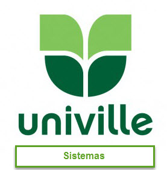

# BDASISUniville

Repositório com scripts SQLs disponibilizados para fins de aprendizagem em banco de dados.

## Trabalho 01

Com base no script MinhaCaixa.sql que foi desenvolvido para MSSQL Server portar ele para os SGBDs listados abaixo.
Cada equipe terá que entregar um Esquema do Banco de Dados, um DER feito no BRModelo e um arquivo SQL para a criação do 
banco.

* MySQL

- Daniel `@DanielFernandoUniville <https://github.com/DanielFernandoUniville>`_, 
- Daniel Custodio `@danielcustodio1 <https://github.com/danielcustodio1>`_, 
- Gustavo Raphael `@gustavoraphael <https://github.com/gustavoraphael>`_, 
- João Reis  `@joaoreis1996 <https://github.com/joaoreis1996>`_, 
- Leandro `@leandrodecampos <https://github.com/leandrodecampos>`_, 
- Juan `@juanvictorcorrea <https://github.com/juanvictorcorrea>`_,
- Marcelo `@MWillyan <https://github.com/MWillyan>`_,  
- Ricardo `@ricardoadilson <https://github.com/ricardoadilson>`_.

* PostgreSQL

-Alexandre `@alexandreWP <https://github.com/AlexandreWP>`_,
-Luan Souza `@Luansilva2 <https://github.com/Luansilva2>`_,
-Rafael Lopes `@rafaellopes21 <https://github.com/rafaellopes21>`_,
-Lais `@laislima <https://github.com/laisticiane>`_,
-Guilherme Rocha `@intorp <https://github.com/Intorp>`_,

* Oracle

-William Rozin Gaspar `@williamrozin <https://github.com/williamrozin>`_, 
-Gustavo Alexsander Ruske `@ruske <https://github.com/GustavoRuske>`_,
-Marcos Peters `@marcospeters <https://github.com/marcospeters>`_, 
-Lucas `@lucaswolfgramm <https://github.com/lucaswolfgramm>`_, 
-Gustavo César Muchon `@gustavomuchon <https://github.com/gustavomuchon>`_, 
-Douglas, 
-Jose Sardagna `@josecleocir <https://github.com/josecleocir>`_,
-Caio Delmonego `@delmonego <https://github.com/delmonego>`_,

* SQL Server

Rodrigo Dornel `@rdornel <https://github.com/rdornel>`_,

-Gabriel `@arilson <https://github.com/Arilson13>`_,
-Guilherme Blank `@guilhermeblank <https://github.com/guilhermeblank>`_,
-Jefferson de Souza Gaieuski	`@Gaieuski <https://github.com/gaieuski>`_,
-João Marcos Schmalz,
-Joao Furlanetto `@joaofurlanetto <https://github.com/joaofurlanetto>`_,
-João Vitor Borba Paul `@joaovitorbpaul <https://github.com/joaovitorbpaul>`_,
-Karoline Zimermann de Souza `@Kkaroliz <https://github.com/Kkaroliz>`_,
-Luan Sergio de Lima Ribas,
-Marcelo Willyan de Sena,
-Marco Aurélio Dalacort Marques,
-Mayke Herbst `@Maykerh <https://github.com/gaieuski>`_,
Ricardo Adilson da Silva,
Samuel Geron `@SamuelGeron <https://github.com/SamuelGeron>`_,
William Rozin Gaspar,
Willian Vilson da Cruz `@WillCruz <https://github.com/WillCruz>`_

Os participantes que não vão estar nas equipes dos SGBDs citados acima vão entrar no projeto do banco de dados para o e-commerce da TrekPix

* RH/Pessoal
* Financeiro/Tesouraria
* Compras/Recebimento
* Cliente/Atendimento
* Vendas/Faturamento
